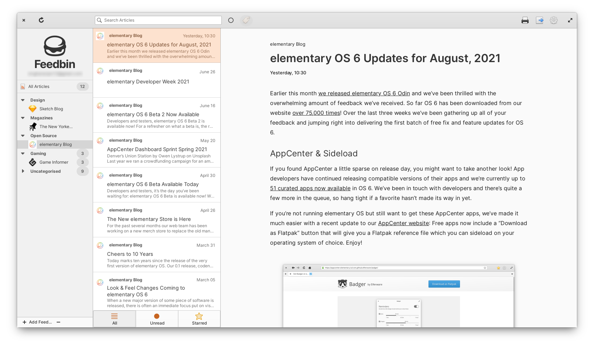
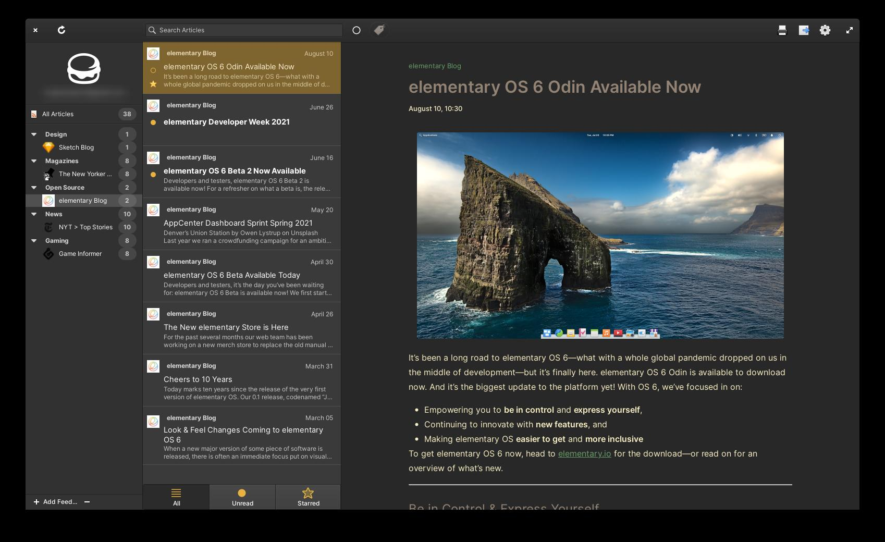

<a href='https://ind.ie/ethical-design'></a>

<p align="center">
  
</p>
<h1 align="center">Communique</h1>
<h2 align="center">Your personal journalist</h2>

|  |  |
|-----------------------------------------------------|----------------------------------------------------|

## Made for [elementary OS](https://elementary.io)

Communiqué is designed and developed on and for [elementary OS](https://elementary.io). It will be available on [AppCenter](https://appcenter.elementary.io) in the near future. Purchasing through AppCenter directly supports me and elementary. Get it on AppCenter for the best experience.

## Developing and Building

If you want to hack on and build Communiqué yourself, you'll need the following dependencies:

```bash
sudo apt-get install \
	build-essential \
	meson \
	ninja-build \
	vala \
	pkg-config \
	libgirepository1.0-dev \
	libgtk-3-dev \
	libgumbo-dev \
	libsoup2.4-dev \
	libjson-glib-dev \
	libwebkit2gtk-4.0-dev \
	libsqlite3-dev \
	libsecret-1-dev \
	libnotify-dev \
	libxml2-dev \
	libunity-dev \
	librest-dev \
	libgee-0.8-dev \
	libgstreamer1.0-dev \
	libgstreamer-plugins-base1.0-dev \
	libgoa-1.0-dev \
	libcurl-dev \
	libpeas-dev \
	libgumbo-dev
```

Run `meson build` to configure the build environment and use `ninja install` to install the app
```bash
meson build --prefix=/usr
cd build
sudo ninja install
```
## Credits
* Original project by [@jangernert](https://github.com/jangernert)
