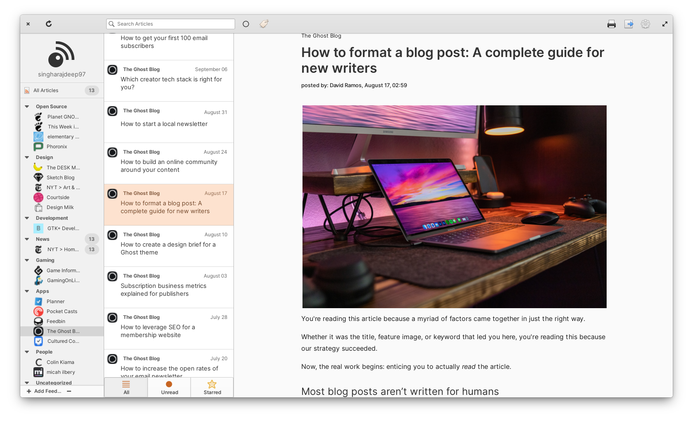
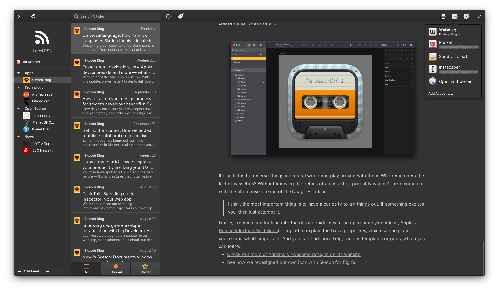

[](https://ind.ie/ethical-design)
[](https://www.gnu.org/licenses/gpl-3.0.en.html)


<p align="center">
  
</p>
<h1 align="center">Communique</h1>
<p align="center">
  <a href="https://appcenter.elementary.io/com.github.suzie97.communique"></a>
</p>




## Your personal journalist
Subscribe to and read RSS/Atom feeds with cross-platform synchronization. Communique is a feed reader with support for a lot of RSS services, like Feedbin, Tiny Tiny RSS, Nextcloud News etc. And ofcourse, you can use Communique to subscribe to and read RSS feeds locally, without logging in to anything.

## Made for [elementary OS](https://elementary.io)

Communique is designed and developed on and for [elementary OS](https://elementary.io). Purchasing through AppCenter directly supports me and elementary. [Get it on AppCenter](https://appcenter.elementary.io/com.github.suzie97.communique) for the best experience.

[](https://appcenter.elementary.io/com.github.suzie97.communique)

## Developing and Building

Flatpak is the recommended way for building Communique. Developing and testing with flatpak helps ensure that everything works correctly inside the flatpak sandbox.
```bash
cd build-aux/flatpak/
flatpak-builder build com.github.suzie97.communique.yml --user --install --force-clean
flatpak run com.github.suzie97.communique.yml
```
## Special Thanks to [@jangernert](https://github.com/jangernert)
* More than 90% of the backend of this project is adopted from his project [FeedReader](https://github.com/jangernert/FeedReader). Communique would not have been possible without FeedReader.
